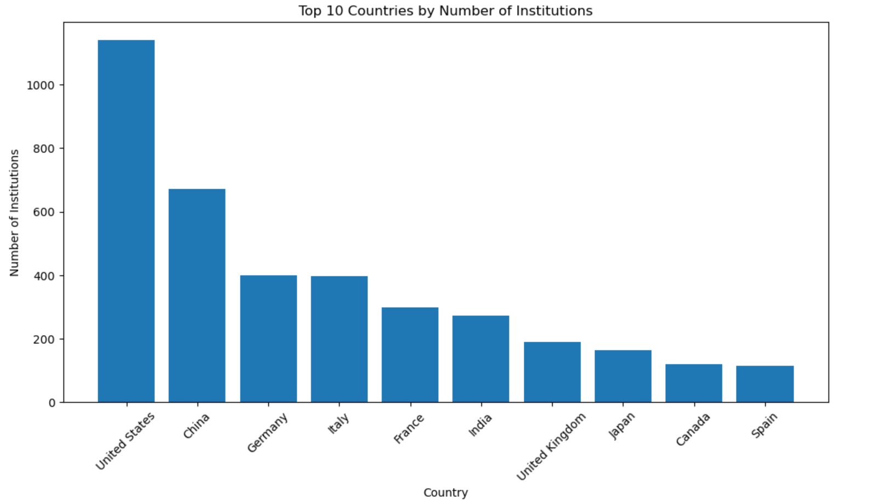
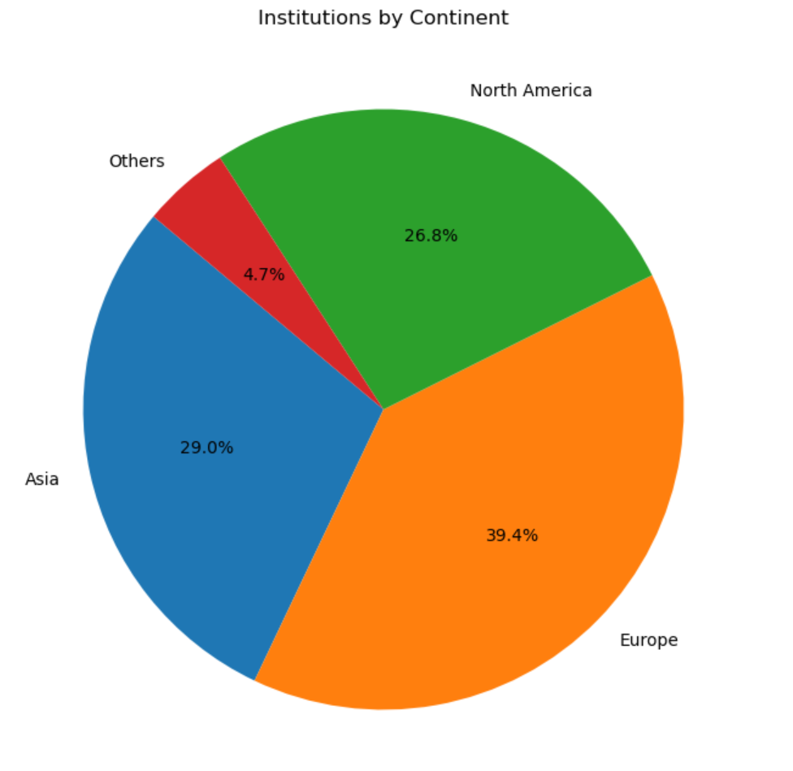
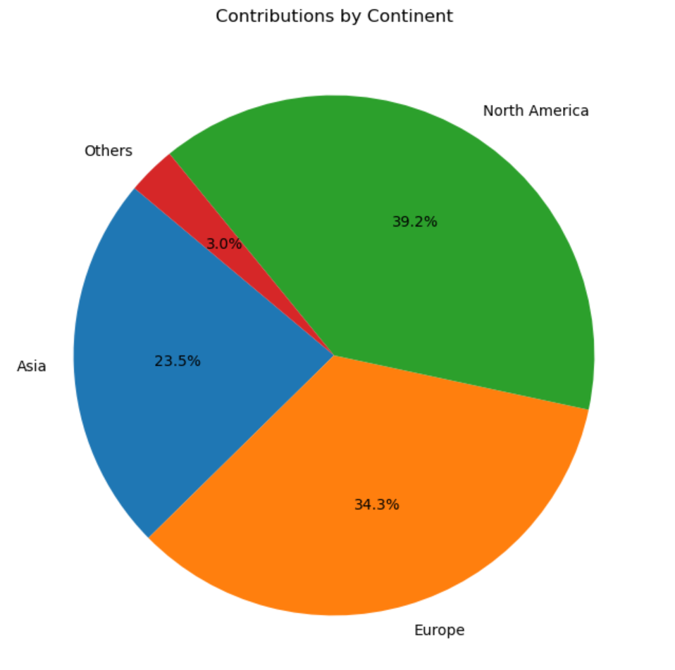

# Predicting Drug-Drug Interactions Based on Likeness and Geographical Prevalence

 What impact does geography have on the development of drugs? Specifically, does drug's origin matter in drug-drug interaction? The development of pharmaceuticals is a collaborative effort that often reflects the expertise and innovation of the institutions behind them. This project aims to investigate whether drugs developed within the same institutions exhibit superior interaction profiles compared to those developed independently. One may hypothesise that shared research environments, methodologies, and collaborative networks contribute to a higher likelihood of favorable interactions among drugs originating from the same institution.

 Does the prevalence of a disease in a region have an effect on local drug development? The world is highly interconnected and an outbreak of any disease anywhere is today a menace for the whole world. Are there however any trends one can observe in the location of drug research with respect to the geographical prevalence of a disease?

These are the research questions we try to answer:
1. **Institutional Influence on DDIs**: Do drugs developed in the same universities interact positively?
2. **Regional Disease Influence on Research**: Does the prevalence of a disease in a region drive the amount and focus of research conducted there?  
3. **Compatibility of Popular Drugs**: Do highly "likable" drugs, based on QED, exhibit good interactions?
4. **Predictive DDI Modeling**: Can we predict interaction outcomes for novel drug pairs, and propose new candidates for future research?

## Some Analysis on BindingDB Dataset

 To answer these questions, we use the BindingDB dataset. It contains data about the binding affinity between ligands and targets. It contains 2937206 results on 1,295,089 ligands and 6746 targets. In total, there are 330 different source organisms for the targets. For each experiment, we have the institution where it was made (university or company). Since we want to make a geographical analysis of the trends of research, we focused on the universities and institutions that are located only in one country (companies have multiple faculties in different countries). 

From this graph, we can see that the United States is the country with the most institutions that have carried out experiments listed in the dataset. Then there is China, Germany and Italy.

From this graph, we can see that the USA is the country that has carried out the most experiments (around 380000 experiments were made in the USA), while China is second with around 150000 experiments and then there is Germany and Italy with around 100000 experiments

From this graph, we can see that Europe is the continent with the most institutions (39.4%) that have carried out experiments listed in the dataset. Then there is Asia (29.0%) and North America (26.8%).

From this graph, we observe that 39.2% of the experiments are made in North America, 34.3% in Europe and 23.5% in Asia while only 3% are made in Africa/Oceania/South America.

In conclusion, we observe that most of the research is done in Europe, North America and Asia. Then we wanted to analyze how research activity aligns with disease presence across countries and continents. We decided to do this analysis on 8 major diseases.

# Does the prevalence of a disease in a region drive the amount and focus of research conducted there?

## WHO database
Up intil now we have done an analysis of the BindingDB database. To carry out an analysis comparing reasearch and disease prevalence, we need data on the prevalence of the diseases researched in the BindingDB data. For this, we will use data from WHO. The data is available at the following link: https://ghoapi.azureedge.net/api/.

After checking the data, we found 8 diseases for which we have data in both databases. These are:
 - Plasmodium Falciparum
 - Human Immunodeficiency Virus
 - Poliovirus
 - Plasmodium vivax
 - Mycobacterium tuberculosis
 - Escherichia coli
 - Hepatitis C
 - Staphylococcus aureus

For each disease, data on the prevalence in different countries is available from WHO. The heatmap below shows the prevalences per capita of these diseases in different regions of the world in proportion to each other:

We can for example observe that many diseases are more prevalent in regions such as Africa and Eastern Mediterranean, as opposed to the Americas and Western Pacific.

## Prevalence-Research Analysis
Having data on quantity of research and disease prevalence in different countries, we can now analyze the relationship between the two. The question of how the prevalence of a disease in a region drives the amount and focus of research conducted there can be answered by comparing the two datasets.

For each disease, we depict below the prevalence of the given disease against the number of experiments conducted on it:

 - Add all 8 graphs showing prevalence vs research

From the graphs we observe that many countries with high prevalence of a disease do not necessarily have a high number of experiments conducted on it. On the other hand, countries with low prevalence of a disease can have a high number of experiments conducted on it. This makes sense, as many countries with high prevalence of a disease might not have the resources to conduct research on it, while countries with low prevalence might have the resources to conduct research on it.

To better quantify the relationship between prevalence and research, we perform a linear regression analysis on the data. We seek to find how well the prevalence of a disease in a region predicts the number of experiments conducted on it in that region. The results of the linear regression analysis are visualized in the following heatmap:

# region-region ols heatmap

