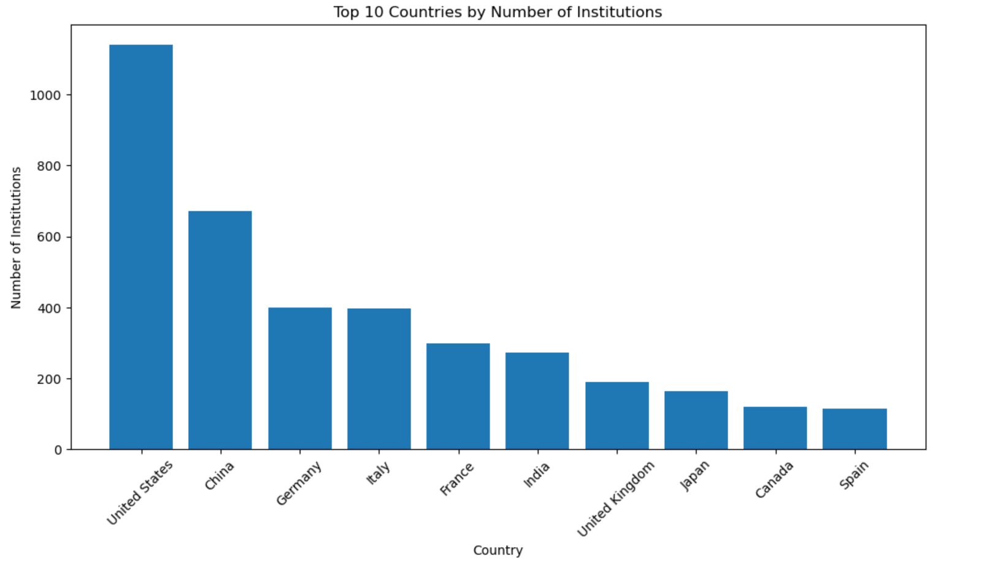
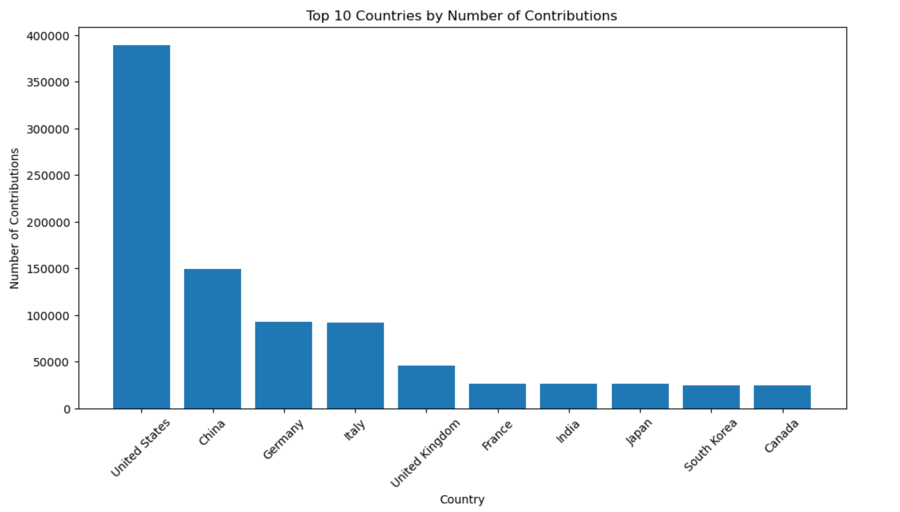
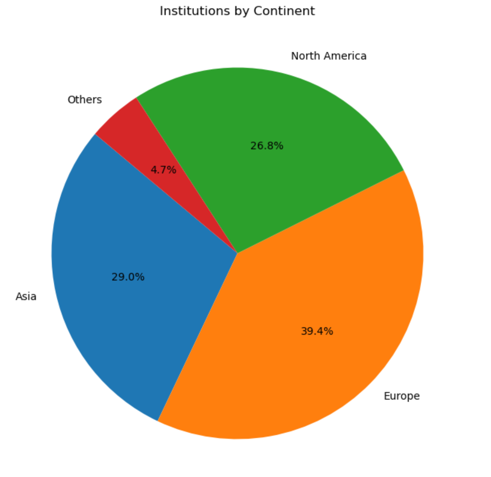
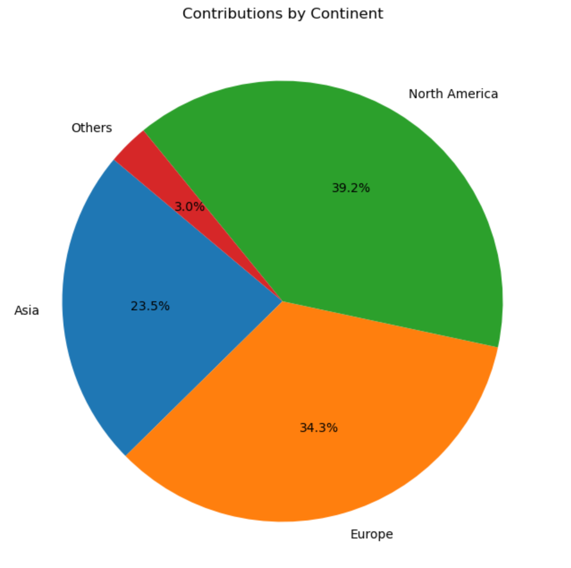
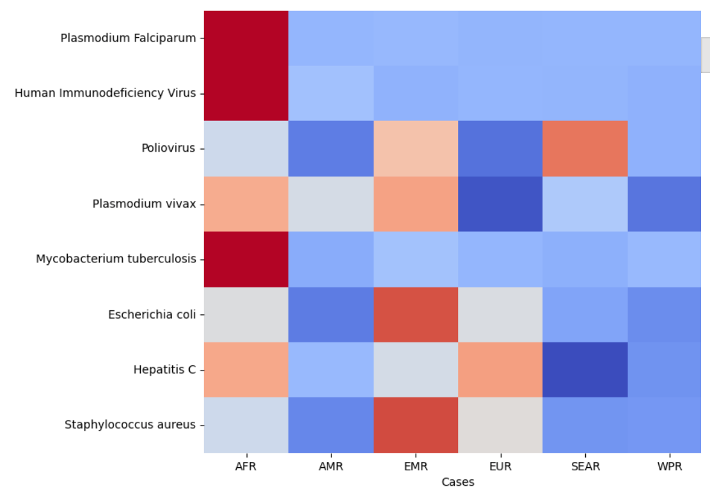

# Predicting Drug-Drug Interactions Based on Likeness and Geographical Prevalence

 What impact does geography have on the development of drugs? Specifically, does drug's origin matter in drug-drug interaction? The development of pharmaceuticals is a collaborative effort that often reflects the expertise and innovation of the institutions behind them. This project aims to investigate whether drugs developed within the same institutions exhibit superior interaction profiles compared to those developed independently. One may hypothesise that shared research environments, methodologies, and collaborative networks contribute to a higher likelihood of favorable interactions among drugs originating from the same institution.

 Does the prevalence of a disease in a region have an effect on local drug development? The world is highly interconnected and an outbreak of any disease anywhere is today a menace for the whole world. Are there however any trends one can observe in the location of drug research with respect to the geographical prevalence of a disease?

These are the research questions we try to answer:
1. **Institutional Influence on DDIs**: Do drugs developed in the same universities interact positively?
2. **Regional Disease Influence on Research**: Does the prevalence of a disease in a region drive the amount and focus of research conducted there?  
3. **Compatibility of Popular Drugs**: Do highly "likable" drugs, based on QED, exhibit good interactions?
4. **Predictive DDI Modeling**: Can we predict interaction outcomes for novel drug pairs, and propose new candidates for future research?

## Some Analysis on BindingDB Dataset

To answer these questions, we use the BindingDB dataset. It provides information on the interactions between proteins and ligands, focusing on binding affinity data. It contains 2,937,206 results on 1,295,089 ligands and 6746 targets. In total, there are 330 different source organisms for the targets. BindingDB provides a lot of data for each experiment, there are 194 columns. For each experiment, we have the binding affinities constants such as Ki, Kd, IC50 and EC50, we have the ligand’s SMILES representation, the target name, the target source organism and the institution where the experiment was made. Since we want to make a geographical analysis of the trends of research, we focused on institutions that are located only in one country (some companies have multiple faculties in different countries).

## Geographical analysis 

The graph shows that the United States has the highest number of institutions conducting experiments listed in the dataset, followed by China, Germany, and Italy.

Based on the graph, the USA has conducted the highest number of experiments listed in the dataset, totaling approximately 380,000. China follows with around 150,000 experiments, while Germany and Italy are next, each contributing roughly 100,000 experiments.

The graph indicates that Europe has the highest proportion of institutions conducting experiments in the dataset, with 39.4%. Asia follows with 29.0%, and North America accounts for 26.8%.

The graph shows that 39.2% of the experiments were conducted in North America, 34.3% in Europe, and 23.5% in Asia, while only 3% took place in Africa, Oceania, and South America combined.

In conclusion, the graphs show that the majority of research is conducted in Europe, North America, and Asia, and most research institutions are also located in these regions.

# Does the prevalence of a disease in a region drive the amount and focus of research conducted there?

## WHO database
Up intil now we have done an analysis of the BindingDB database. To carry out an analysis comparing reasearch and disease prevalence, we need data on the prevalence of the diseases researched in the BindingDB data. For this, we will use data from WHO. The data is available at the following link: https://ghoapi.azureedge.net/api/.

After checking the data, we found 8 diseases for which we have data in both databases. These are:
 - Plasmodium Falciparum
 - Human Immunodeficiency Virus
 - Poliovirus
 - Plasmodium vivax
 - Mycobacterium tuberculosis
 - Escherichia coli
 - Hepatitis C
 - Staphylococcus aureus

For each disease, data on the prevalence in different countries is available from WHO. The heatmap below shows the prevalences per capita of these diseases in different regions of the world in proportion to each other:

We can for example observe that many diseases are more prevalent in regions such as Africa and Eastern Mediterranean, as opposed to the Americas and Western Pacific.

## Prevalence-Research Analysis
Having data on quantity of research and disease prevalence in different countries, we can now analyze the relationship between the two. The question of how the prevalence of a disease in a region drives the amount and focus of research conducted there can be answered by comparing the two datasets.

For each disease, we depict below the prevalence of the given disease against the number of experiments conducted on it:

 - [HIV](plot_HIV.html)
 - [Plasmodium falciparum](plot_Plasmodium_falciparum.html)
 - [Poliovirus](plot_Poliovirus.html)
 - [Plasmodium vivax](plot_Plasmodium_vivax.html)
 - [Tuberculosis](plot_Tuberculosis.html)
 - [Hepatitis C](plot_Hepatitis_C.html)
 - [Escherichia coli](plot_Escherichia_coli.html)
 - [Staphylococcus](plot_Staphylococcus_aureus)

From the graphs we observe that many countries with high prevalence of a disease do not necessarily have a high number of experiments conducted on it. On the other hand, countries with low prevalence of a disease can have a high number of experiments conducted on it. This makes sense, as many countries with high prevalence of a disease might not have the resources to conduct research on it, while countries with low prevalence might have the resources to conduct research on it.

To better quantify the relationship between prevalence and research, we perform a linear regression analysis on the data. We seek to find how well the prevalence of a disease in a region predicts the number of experiments conducted on it in that region. The results of the linear regression analysis are visualized in the following heatmap:

# region-region ols heatmap

